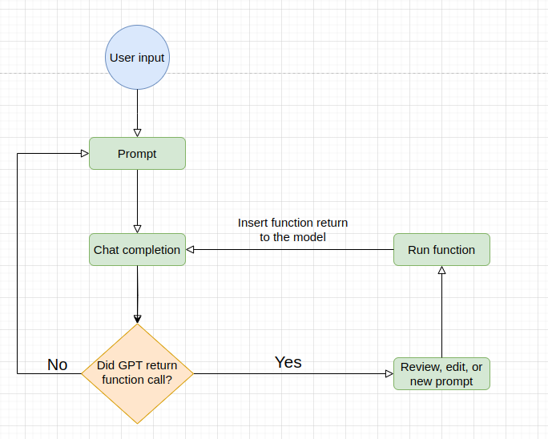

# ai-playwright-gpt-functions

## Description

This repo is a demonstration of how to use GPT-3 to generate text using Playwright. We use tools written in langchain library along with openai's function calls.

## Setup

- python (our experiments run on python 3.10.12)
- Install langchain

```
pip install langchain playwright
```

## Usage

- run `python main.py`
- You will enter a User-agent loop. You can prompt, validate and communicate with our written "agent".

## How it works?


